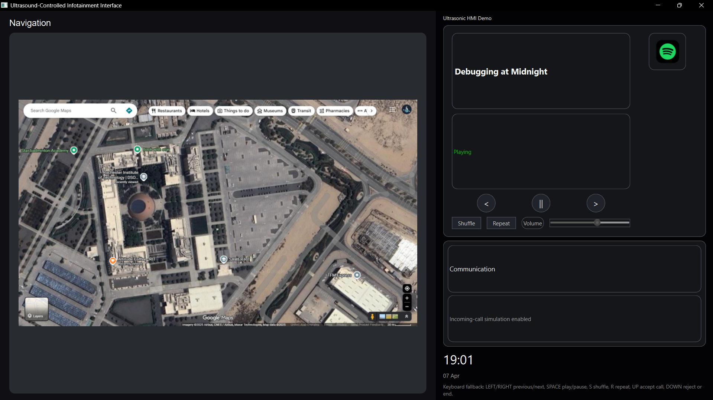
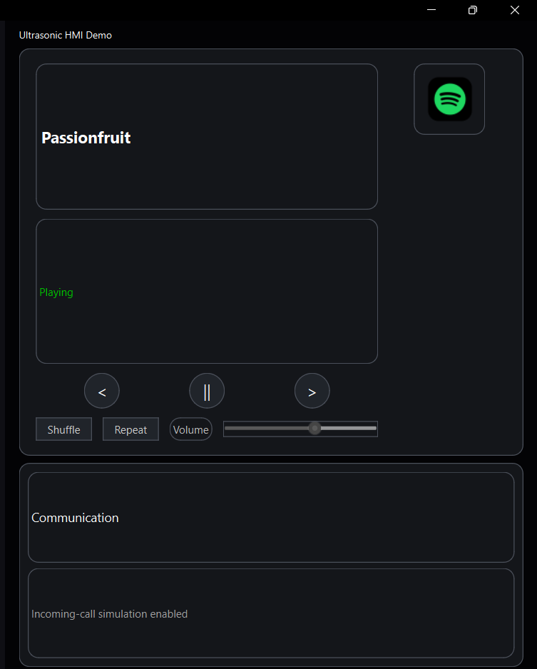
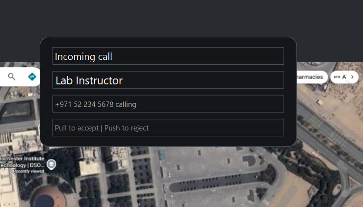
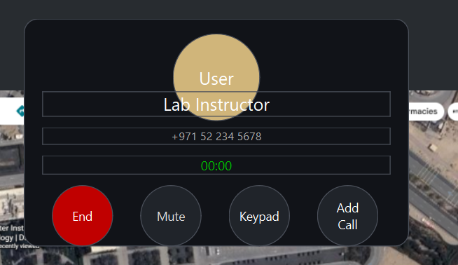
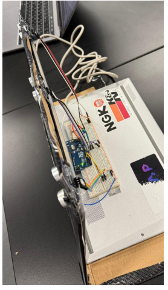
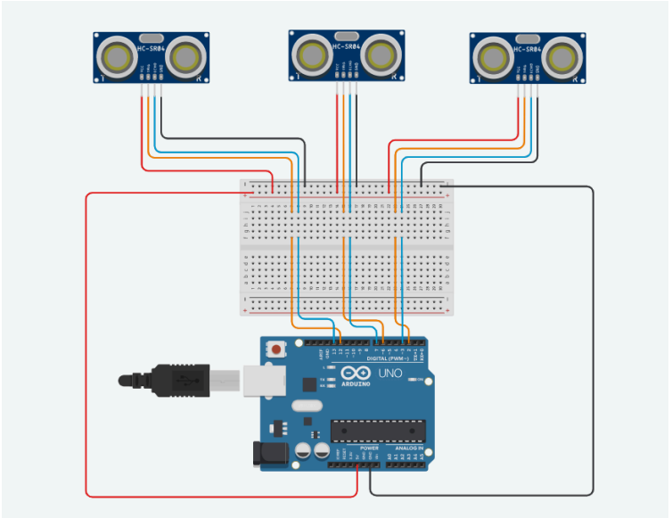
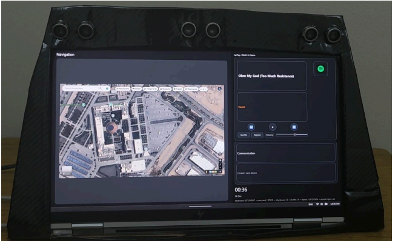

# Ultrasound-Controlled Infotainment Interface

A PyQt6 desktop prototype inspired by rotary and gesture-based in-car infotainment systems. The project connects a serial-based ultrasonic gesture input stream to a media and calling interface, demonstrating how simple embedded sensing can drive a human-machine interface.

## Overview

This project was originally developed as a university embedded systems project and has been cleaned up for portfolio presentation without changing the core concept. It focuses on UI behavior, serial communication, and interaction mapping rather than production automotive integration.

## Key Features

- Gesture-driven track navigation using serial input labels such as `SWIPE_LEFT`, `SWIPE_RIGHT`, `PUSH`, and `PULL`
- Desktop infotainment-style interface built with PyQt6
- Simulated music playback controls with playlist, volume, shuffle, and repeat toggles
- Simulated incoming-call flow with accept, reject, and end-call states
- Keyboard fallback controls for demonstrations when hardware is unavailable
- Portable asset loading and configurable serial port settings

## Tech Stack

- Python
- PyQt6
- pyserial
- Desktop UI programming
- Embedded systems / sensor-to-interface interaction logic

## Project Structure

```text
.
|-- app.py
|-- audio_manager.py
|-- serial_reader.py
|-- state.py
|-- ui_mainwindow.py
|-- requirements.txt
|-- assets/
|   |-- audio/
|   |-- images/
|   `-- screenshots/
`-- README.md
```

## Installation

1. Create and activate a virtual environment.
2. Install dependencies:

```bash
pip install -r requirements.txt
```

## How to Run

Run the desktop app with:

```bash
python app.py
```

By default, the app looks for an Arduino or compatible serial device on `COM4` at `9600` baud. You can override that for your setup:

```powershell
$env:ULTRASONIC_SERIAL_PORT="COM6"
$env:ULTRASONIC_BAUDRATE="9600"
python app.py
```

If no serial device is connected, the interface still opens and can be demonstrated using the keyboard:

- `Left` / `Right`: previous or next track
- `Space`: play or pause
- `S`: toggle shuffle
- `R`: toggle repeat
- `Up`: accept an incoming call
- `Down`: reject or end a call

## Screenshots

### Main Interface



Default infotainment view showing the navigation panel, media controls, and dashboard-style layout.

### Media Playback



Track playback state with music controls driven through the same event flow used by keyboard and serial gesture input.

### Incoming Call Simulation



Incoming-call popup state used to demonstrate accept and reject interactions.

### Active Call State



In-call screen with timer and call actions after an incoming call is accepted.

### Hardware and System Context



Prototype hardware setup used to drive the gesture-based interaction demo.



Circuit-level view of the embedded setup behind the interface prototype.

### Final Prototype View



Combined project view showing the software and hardware concept as a finished course prototype.

## Project Background

The interface concept was inspired by systems such as BMW iDrive and adapted into a university embedded systems project. The goal was to explore how ultrasonic sensing and simple gesture recognition could control a software UI in a clear, testable way.

## Limitations

- Gesture recognition logic is expected to arrive through serial input and is not implemented as signal processing inside this repository
- The calling and music experiences are simulations intended for interaction demos
- The current implementation uses a lightweight global-state approach to keep the project easy to follow
- Audio assets included here are demonstration media and may need replacement if you want fully original distribution-ready content

## Future Improvements

- Replace simulated gesture labels with documented firmware-side gesture classification
- Add a small settings panel for selecting serial ports at runtime
- Refactor state handling into a more structured model-controller design
- Add a short demo video or animated GIF for faster portfolio review
- Document the hardware wiring and sensor calibration process

## Author

Omar Nayyar

If you use this project as a reference, please keep the academic origins and prototype scope in mind.
